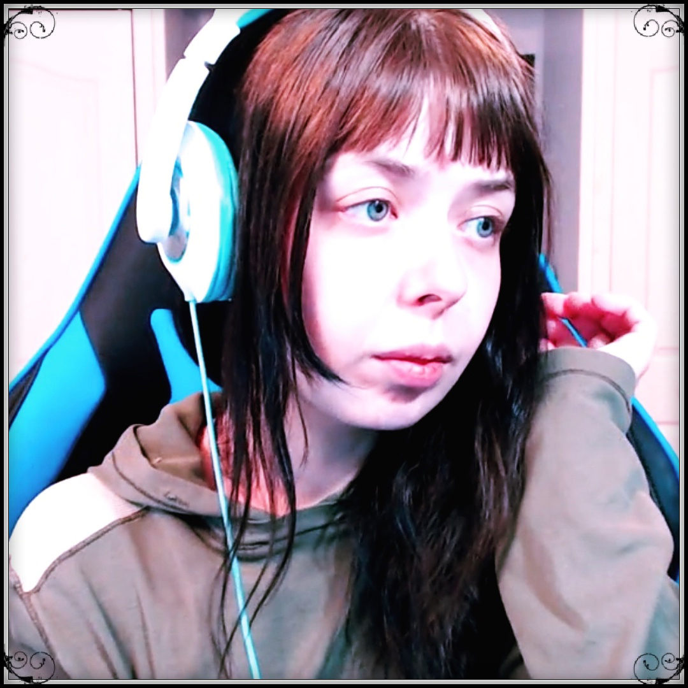
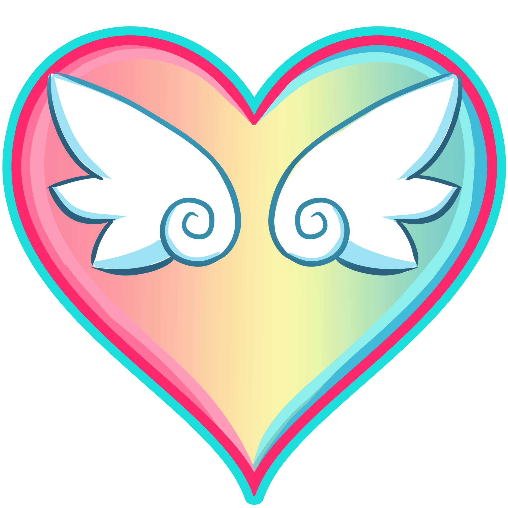

# About

* 
* ## DeviCat

  I’m a self taught digital illustrator, and a full
  time Twitch Partnered broadcaster. Here, we encourage the ideals of positive
  community through creativity and determination.

---

* ## .hallwayRaptor™

  HallwayRaptor, my husband who works behind the scenes to help make this
  stream be able to run full time and managing the community.

* 

---

* 

* ## About DeviCat
  * **Name:** Rachelle (Most people call me by Devi)
  * **Nationality:** Canadian
  * **Streaming on Twitch since:** May 28, 2015
  * **Partnered on Twitch since:** July 5, 2016
  * **Role:** Artist / Speaker / Community Leader
  * **Self Taught:** Traditional Art (all my life) / Digital Art (2+ years)
  * **Interested In:** Being able to help inspire and change the lives of those that I come in contact with.
  * **♡Married to:♡** [HallwayRaptor](https://www.twitter.com/HallwayRaptor)
  * **Favorite Hobby:** Nature Walking
  * **Favorite Games:** Atelier Series / Animal Crossing / Visual Novels
  * **Favorite Drink:** Coffee
  * **Favorite Anime:** A – Channel / K-ON! / CardCaptor Sakura / Kiniro Mosaic / Flying Witch / Konohana Kitan / Slow Start
  * **Awards / Accomplishments:**
    - Animaritime Art Contest 2017, 1st Place.
    - Charity Stream: Create for Kids 2017 (Raised over $600 USD)
    - Charity Stream: 1000 Dreams Fund 2018 (Raised over $600 USD)
    - Featured on Twitch Front Page (Anime Spotlight): October 26th & November 2nd 2017.
    - Featured on Twitch Front Page (Women's History Month): March 14th, 2018.
    {: .bulleted}

---

* ## Our Symbol

  The rainbow and the wings / antlers are the representation of: *The freedom
  and wisdom to accept everyone and the freedom and wisdom to be accepted by
  everyone.* It is what we stand for and hope to inspire in others.

* 

---

## A Little Background Of Our Roots

I was given the opportunity to start streaming full time back in May of 2015
because of my husband HallwayRaptor. Back then I was going through major life
chapters; my dad had passed of cancer in March of 2014 and during this time
frame I found myself to be fighting symptoms of PTSD from past verbal abuse.
Originally, before I started on Twitch, my healing began with writing blogs on
this website, taking dance lessons, doing odd little jobs like house sitting,
and watching a lot of Day9TV (Mostly Walking), Markiplier, and ManlyBadAssHero
before I was introduced to the wonderful world of Twitch. And even when I began
doing this full time, I had no idea what I was doing. We started from the ground
up as a tiny variety channel, knowing no one, my husband working his day job to
help take care of us. And over the course of the past couple of years we’ve
moved provinces, got married, upgraded our equipment, improved our quality of
content, and over all evolved into a professional full time channel. Our
motivation comes from wanting to inspire others to work through their personal
obstacles by setting a positive example ourselves. Our long term goals are to
become financially independent so that we can become investors and one day do
amazing things such as creating foundations or charities.

To this day, HallwayRaptor now works alongside me at home to help manage this.
It’s a team effort, be it with Raptor and myself, our mods and this community.
We cannot thank you enough for these opportunities, and every day we are doing
our best to give back and pay your kindness forward.

💕Thank you for believing in us.💕
