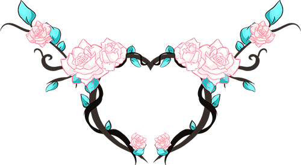

# About

* 
* ## DeviCat

  My name is Rachelle, but most people know me as DeviCat. I’m a self taught digital illustrator, full
  time Twitch Partnered broadcaster, and part time video creator on YouTube. Here, we encourage the ideals of positive
  community through creativity and determination.

  The title "DeviCat" comes from Deviant Category. Which means to deviate from the ordinary, to take the path less known. 

---

* ## .hallwayRaptor™

  This is my husband, Robert, who works behind the scenes to help make this
  stream be able to run full time and managing the community.

* 

---

* 

* ## About DeviCat
  * **Name:** Rachelle 
  * **Nationality:** Canadian
  * **Streaming on Twitch since:** May 28, 2015
  * **Partnered on Twitch since:** July 5, 2016
  * **Role:** Artist / Content Creator
  * **Self Taught:** Traditional Art / Digital Art
  * **Interested In:** Creating to put a smile on your face and a warmth in your heart.
  * **♡Married to:♡** [HallwayRaptor](https://www.twitter.com/HallwayRaptor)
  * **Favorite Hobby:** Nature Walking, Vocaloid Dancing
  * **Favorite Games:** Visual Novels
  * **Favorite Drink:** Coffee
  * **Favorite Anime:** Anything slice of life genre.

---

* ## Take Root & Dream

  This icon, with the flowers and the branches, is the representation of the evolution of my dream as an artist and as a person. It symbolizes to let your dreams bloom into the beautiful flower they were meant to be. No matter how much we may change and grow, it's important to reflect on our roots to appreciate who we are now.
  
  *“I believe everyone has the potential to not only do something amazing, but the ability for compassion to themselves and those around them." - DeviCat* 

* 

---

## A Little Background Of Our Roots

I was given the opportunity to start streaming full time back in May of 2015
because of my husband, Robert. Back then I was going through major life
chapters; my dad had passed of cancer in March of 2014 and during this time
frame I found myself to be fighting symptoms of PTSD from past verbal abuse.
Originally, before I started on Twitch, my healing began with writing blogs on
this website, taking dance lessons, doing odd little jobs like house sitting,
and watching a lot of Day9TV (Mostly Walking), Markiplier, and ManlyBadAssHero
before I was introduced to the wonderful world of Twitch. And even when I began
doing this, I had no idea what I was doing. We started from the ground
up as a tiny variety channel, knowing no one, my husband working his day job to
help take care of us. And over the course of the past few years we’ve
moved provinces, got married, improved our quality of
content, and over all evolved into professional full time content creators. Our
motivation comes from wanting to inspire others to work through their personal
obstacles by setting a positive example ourselves. 

To this day, Robert now works alongside me at home to help manage this.
It’s a team effort, be it with Raptor and myself, our friends and this community.
We cannot thank you enough for these opportunities, and every day we are doing
our best to give back and pay your kindness forward.

**
Thank you for believing in us.
**
