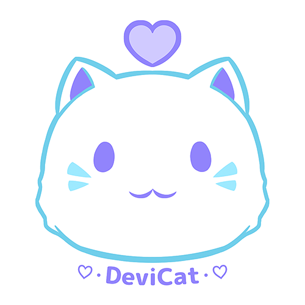

# About

* 

* ## About DeviCat
  * **Name:** Rachelle 
  * **Nationality:** Canadian
  * **Streaming on Twitch since:** May 28, 2015
  * **Partnered on Twitch since:** July 5, 2016
  * **Creating videos on YouTube since:** August , 2018
  * **Role:** Artist / Content Creator
  * **Self Taught:** Traditional Art / Digital Art / Vocaloid Dance
  * **Interested In:** Creating to put a smile on your face and a warmth in your heart.
  * **♡Married to:♡** [HallwayRaptor](https://www.twitter.com/HallwayRaptor)
  * **Favorite Hobby:** Nature Walking
  * **Favorite Games:** Visual Novels
  * **Favorite Drink:** Coffee
  * **Favorite Anime:** Anything slice of life genre.

  ---

  My name is Rachelle, but most people know me as DeviCat. I’m a self taught digital illustrator and full time content creator on Twitch.tv, YouTube and Patreon. Here, we encourage the ideals of positive community through creativity and determination.

The title "DeviCat" has a whole history to its creation. It started as a nickname for a cat character I had to animate for a school project. When I decided to start streaming on Twitch, I wanted a username that wasn't my real name, so I decided to use "DeviCat" instead as my pseudonym. To this day, some people still joke and think it means a "devil cat", others take it to a deeper meaning and refer to "Devi" as "goddess." Myself? I just think it sounds cute!

“I believe everyone has the potential to not only do something amazing, but the ability for compassion to themselves and those around them.” - DeviCat

---

