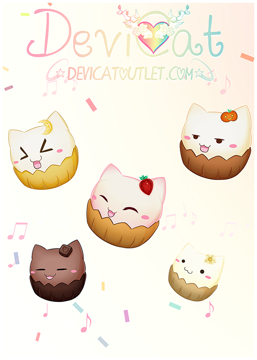
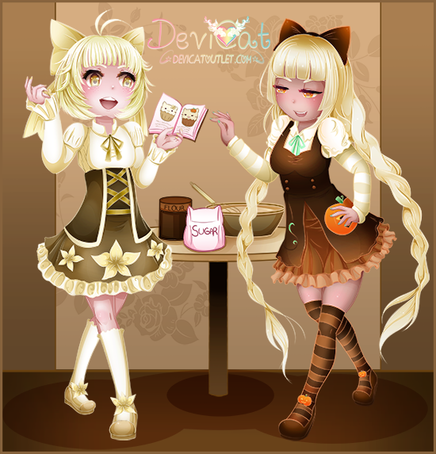
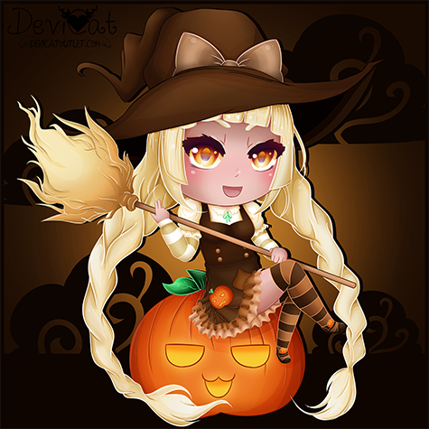
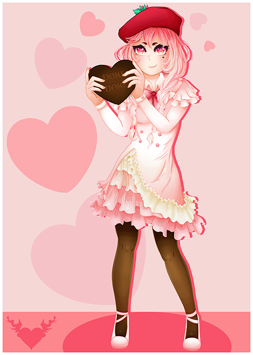

There isn’t a whole lot to be said about the catcupcakes as they are newly
developed characters of the channel. One could say they are the purest
representation of personality types that are not always appreciated. 

The original concept in mind with the catcupcakes was to have ranks for viewers
of the channel. The more you watched the channel, the more your rank increased,
the further up the cake line you go. Now these little cuties have their own personalities and character traits!

