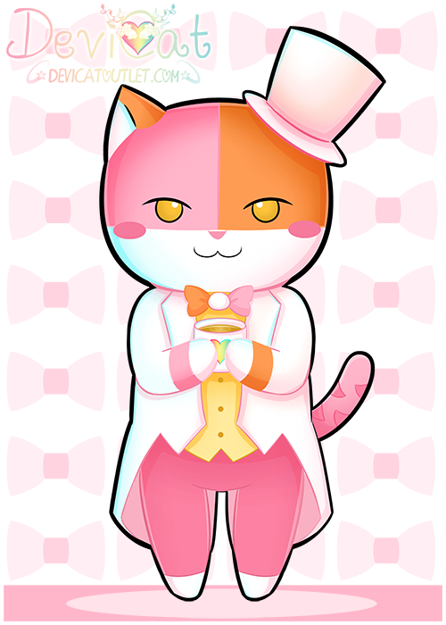

There isn’t a whole lot to be said about DapperCat in his current state as he
is a newly developed character. One could say that he is the representation of
unexpected helping hands that Devi has had in her life of various people.

DapperCat probably has the most complex of background of all the characters.
His origin started as Danishbot, the arch-nemesis of the channel in the bake off
mini games. Originally identifying as a pastry chef. Over time, Devi created
another character (literally), a make shift dapper fox plushie. When she tried
to give Danishbot a human form, something just didn’t feel right, so she
scrapped the idea. Over time, she combined aspects of Danishbot, dapper fox, and
her cats Chii & Lita, and together they made DapperCat. He is currently voice
acted by Devi’s friend [“BurningOil” on Twitch.tv](https://twitch.tv/burningoil).

### DapperCat Original Form

### DapperCat Human Form

