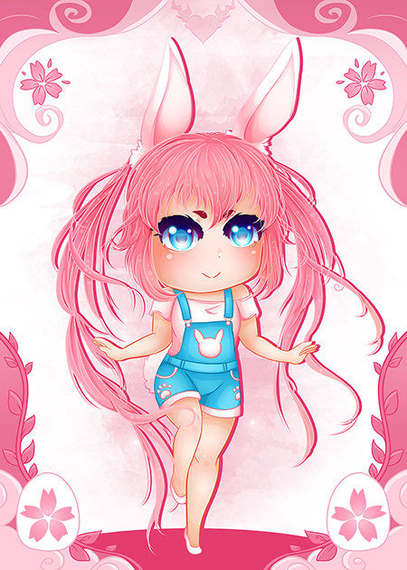
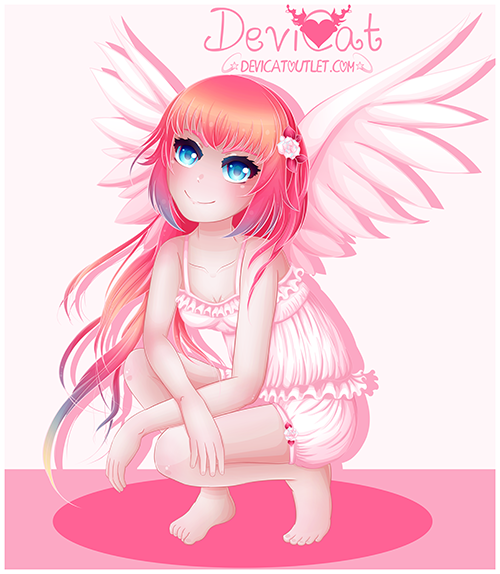
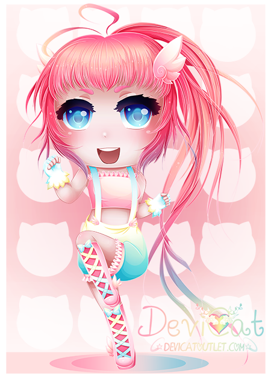

# Momoko
## (CutieCakeBot)

* **Name:** Momoko (Meaning: Peach Child)
* **Title:** CutieCakeBot
* **Hair Color:** Pink / Peach.
* **Eye Color:** Blue.
* **Personality:** A kamidere, in the simplest terms, is an anime archetype for characters with a god complex.
* **Color Scheme:** White and pink.
* **Symbol:** Angel wings.
* **Representation / Inspiration:** A chapter of Devi’s life: the symbol of confidence.

Momoko is the first out of the four main original characters for the channel.
Originally named CutieCakeBot, the initial concept was to be a bot for the
channel that dispensed cakes as the currency for the viewers. This in mind,
she didn’t have a body or a personality at first. Over time, as the fan base
grew, viewers attempted at creating their own interpretations of her which
further inspired Devi to officially give her a body and then eventually a name.

### ✨ Momoko to date: ✨

First creation of Momoko: 

