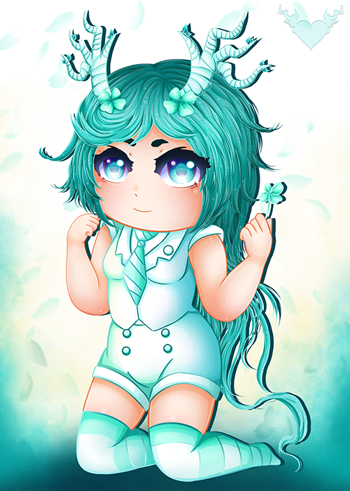
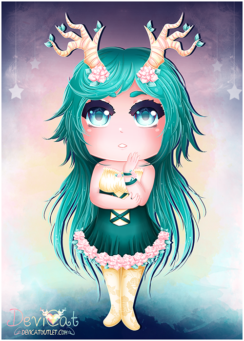
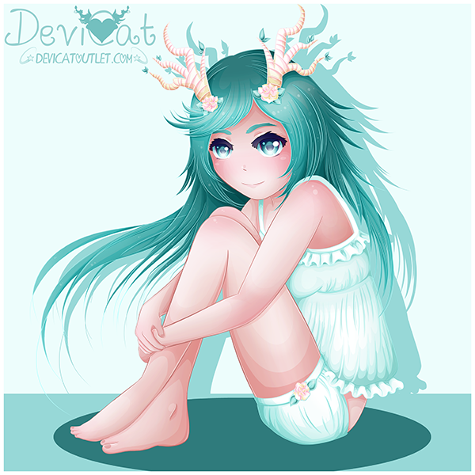
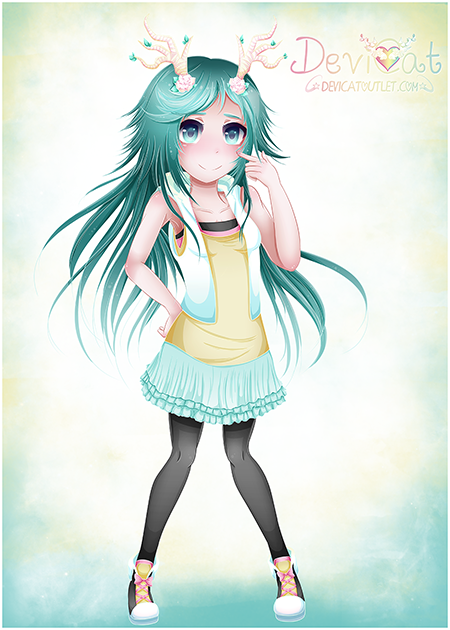
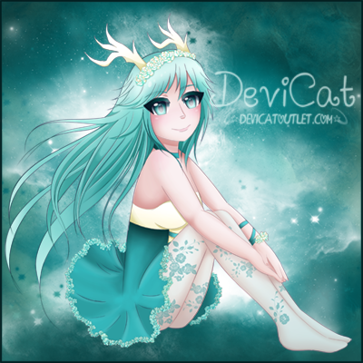

# Reiko
# (Fauna Sister)

* **Name:** Reiko (Meaning: Flower Child)
* **Title:** Fauna Sister
* **Hair Color:** Teal.
* **Eye Color:** Teal.
* **Personality:** Deredere (デレデレ) meaning to become ‘lovey dovey’. Someone
  who wishes to be friends with everyone.
* **Color Scheme:** White and teal.
* **Symbol:** Elk antlers.
* **Representation / Inspiration:** A chapter of Devi’s life: the symbol of
  hope and friendship.

Reiko is the third out of the four main original characters for the channel.
Not much is known of her yet as she is a fairly new and developed character.
Some could say she is from times of Devi’s life when she was blissful. She
is the symbol of pure happiness, the willingness to give others the benefit
of the doubt and welcome everyone. She sticks very closely with her
counterpart, Rin the fauna.

### Reiko to date:

First creation of Reiko: 

