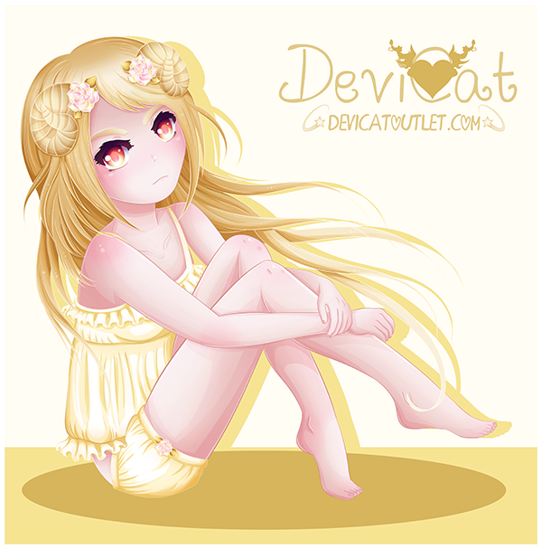
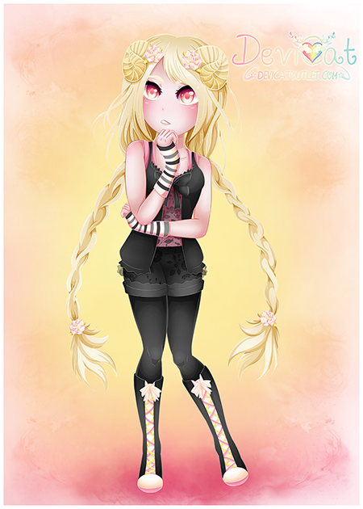
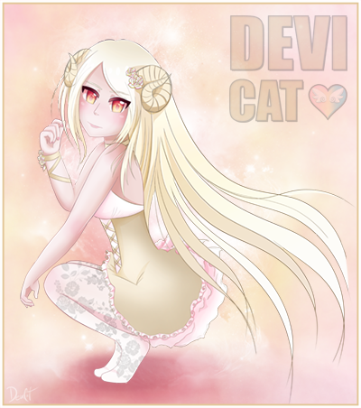

# Rin
## (Fauna Sister)

* **Name:** Rin (Meaning: Cold Child)
* **Title:** Fauna Sister
* **Hair Color:** Light blonde / gold.
* **Eye Color:** Hot pink, gold and yellow.
* **Personality:** Kuudere – calm and composed. Serious on the outside,
  they are the observer, reluctant to trust.
* **Color Scheme:** White and gold, with hints of yellow and pink.
* **Symbol:** Ram horns.
* **Representation / Inspiration:** A chapter of Devi’s life: the symbol
  of judgement.

Rin is the fourth out of the four main original characters for the channel.
Not much is known of her yet as she is a fairly new and developed character.
Some could say she is from times of Devi’s life when she lost all trust with
people who were once friends. She is the symbol of judgement, the observer,
and is fearful of betrayal. She sticks very closely with her counterpart,
Reiko the fauna.

### ✨ Rin to date: ✨

First creation of Rin: 

