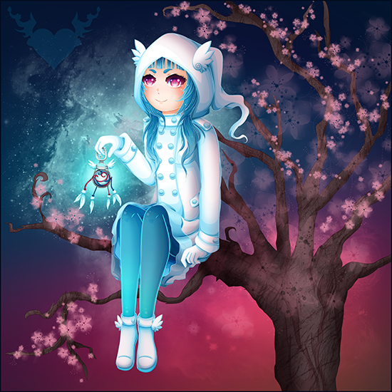
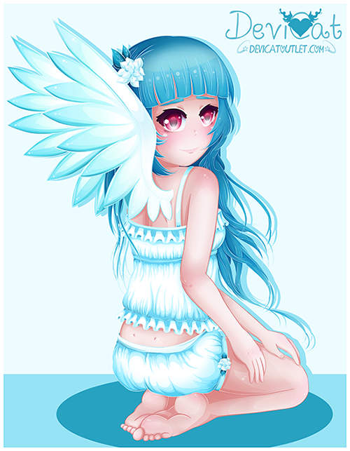
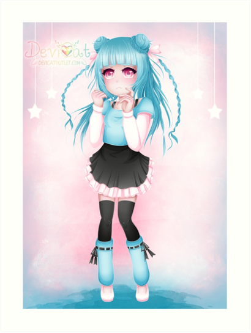
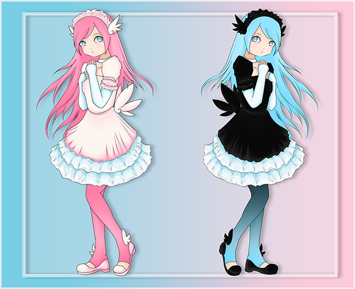

# Shizuko
## (Shiny CutieCakeBot)

* **Name:** Shizuko (Meaning: Quiet Child)
* **Title:** Shiny CutieCakeBot
* **Hair Color:** Blue.
* **Eye Color:** Hot pink.
* **Personality:** Dandere. The “dan” in dandere comes from the Japanese word
  “danmari” (黙り) meaning silence. Thus a dandere is a quiet and often
  antisocial character.
* **Color Scheme:** White and blue.
* **Symbol:** Angel wings.
* **Representation / Inspiration:** A chapter of Devi’s life: the symbol of
  despair, a longing for hope.

Shizuko is the second out of the four main original characters for the channel.
Originally named Shiny CutieCakeBot, the initial concept was to be a shiny
version of Momoko (a similar concept to a colored skin.) As time went on, Devi
felt that this character deserved the right to be it’s own person and not just
Momoko’s reflection, so she gave her a name and a chapter of her life. Shizuko’s
representation hits a darker part of Devi’s life as she is the image of grief
and pain. Being a twin to Momoko, it’s hard to say which one actually came
first. Though Momoko was technically established in the beginning, due to the
representation, we can say that Shizuko’s despair gave birth to the strength of
Momoko.

### ✨ Shizuko to date: ✨

First creation of Shizuko: 

